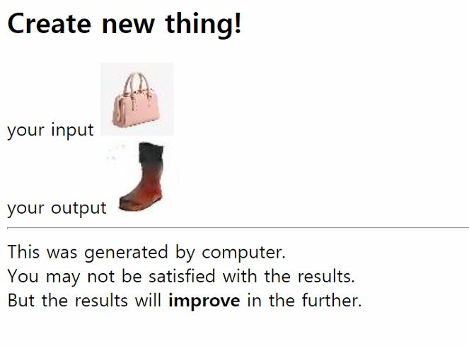

# DiscoGAN_webservice

    
    

## Prerequisites
### DiscoGAN
- Python3
- PyTorch
- Numpy/Scipy
- OpenCV
- Cuda 9.0 (현재 저장된 model은 cuda을 이용함)

### Server
- Apache
- PHP

## Execution
- Python  

        $ python load_image.py [input_file path] [result_folder path] [dataset kind(A or B)]
    
- Website
  - index.html : image를 upload하면 server에 저장하고 upload.php 실행
  - upload.php : load_image.py를 실행시켜 DiscoGAN으로 image 변환 후 저장 및 출력

## Reference
Official paper : [https://arxiv.org/pdf/1703.05192.pdf](https://arxiv.org/pdf/1703.05192.pdf)  
Official implement : [https://github.com/SKTBrain/DiscoGAN](https://github.com/SKTBrain/DiscoGAN)
